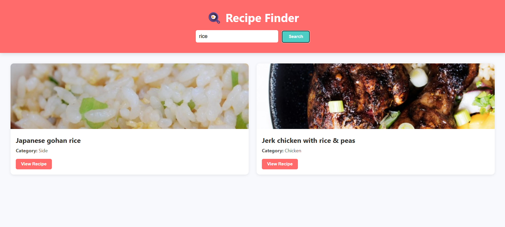

# 🍳 Recipe Finder

A modern and responsive web application to search and view delicious recipes using the [MealDB API](https://www.themealdb.com/). Users can search for meals by name, view ingredients, and read cooking instructions.

## 🚀 Live Demo

🔗 [Click here to try the Recipe Finder](https://sarbeswarbhol.github.io/recipe-finder/) 

## 🔍 Features

* Real-time recipe search using MealDB API
* Responsive layout with CSS Grid
* Ingredient list and detailed instructions toggle
* Smooth UI with interactive recipe cards

## 📸 Preview

### 🔹 Home & Search

### 🔹 Recipes Display

### 🔹 Recipe Details

## 🛠️ Technologies Used

* HTML5
* CSS3 (Flexbox + Grid)
* Vanilla JavaScript
* [MealDB API](https://www.themealdb.com/api.php)
